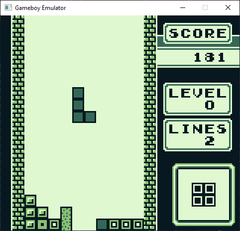
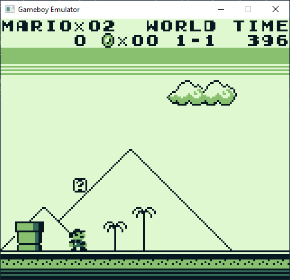

# GameBoyCPP
A Game Boy emulator written using C++ and SDL.
## Features
- Reasonably accurate CPU emulation
- Full sound support
- Supports the No MBC and MBC1 cartridge types
## Building
Currently, there is only build support for Windows.
- Install Microsoft Visual Studio Community 2019.
- Open `GameBoyCPP.sln` and build.
## Usage
Run GameBoyCPP.exe from command line, with the game ROM as argument 1 and the boot ROM as argument 2.  
e.g. `GameBoyCPP.exe tetris.gb dmg_boot.bin`  
The boot ROM is optional, so if you don't want the bootup animation you can just run as:  
`GameBoyCPP.exe tetris.gb`
## Screenshots

## Future Plans
- Rewrite of memory system
- Game Boy Colour support
- Implement more MBCs
- Linux support